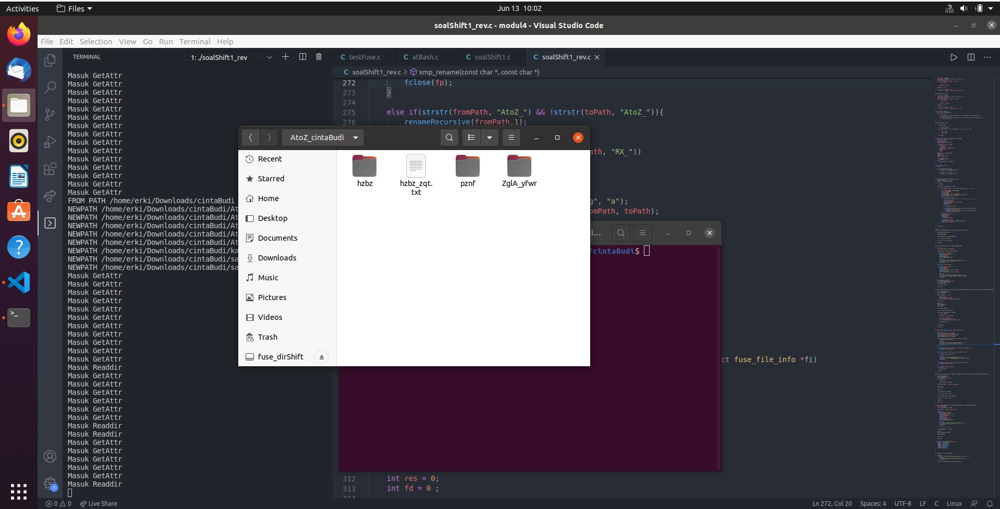
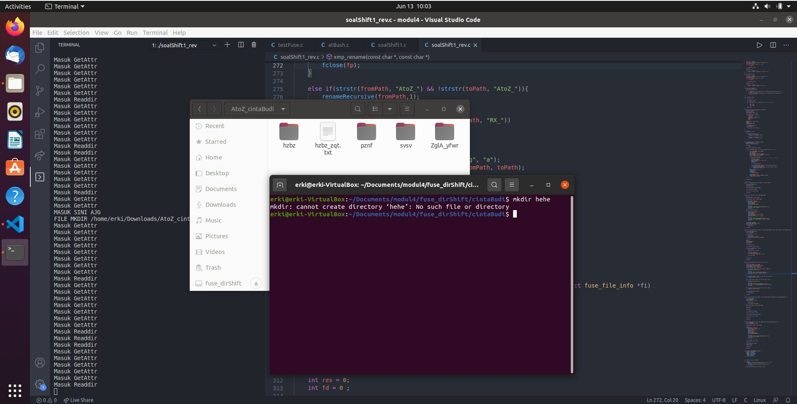
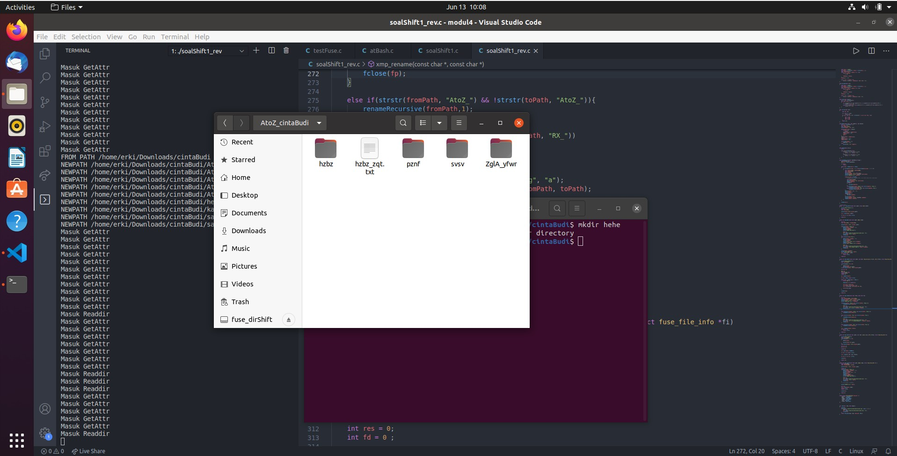
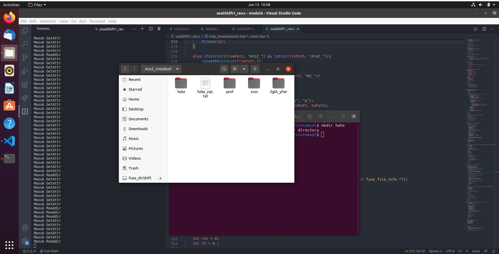
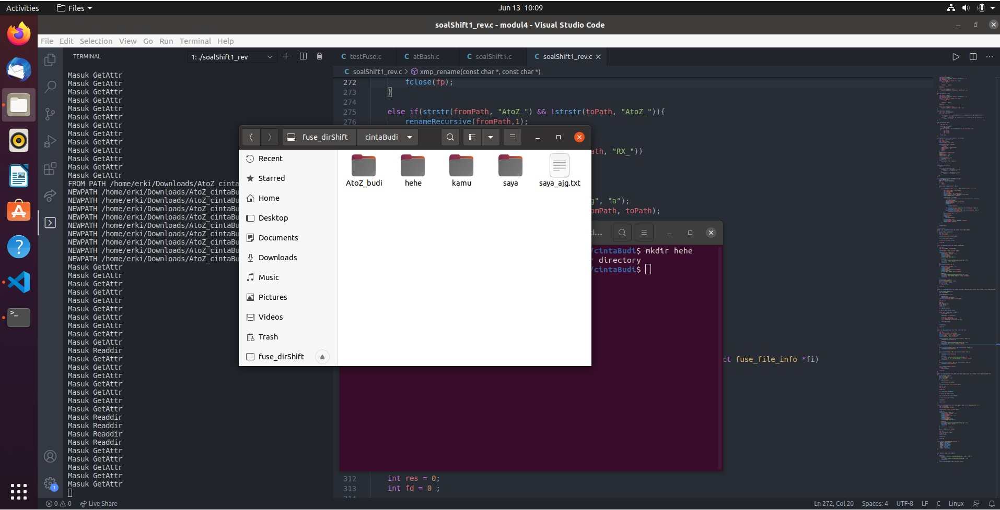
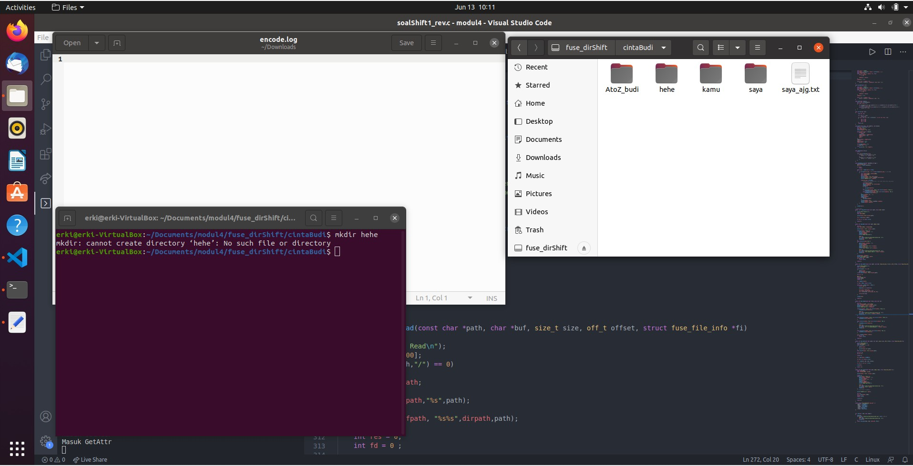
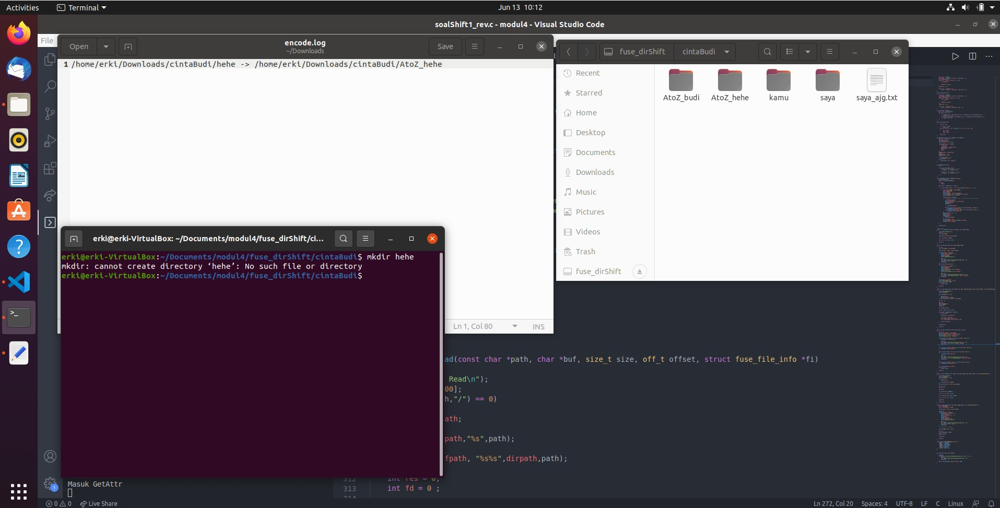
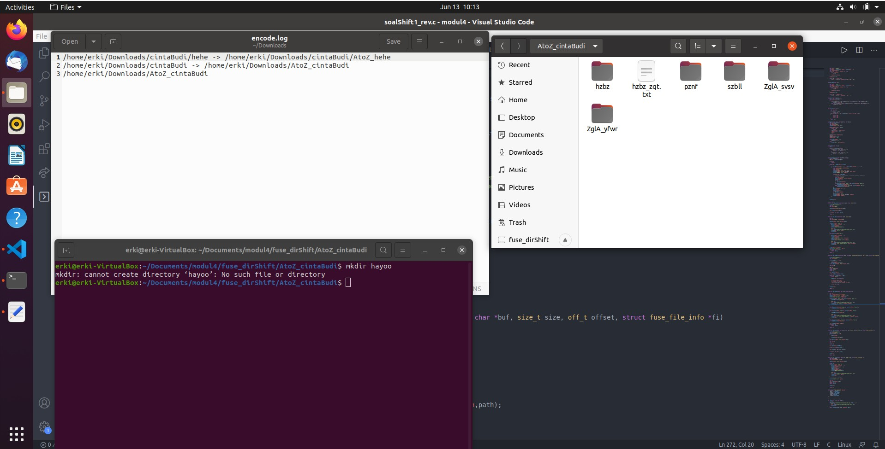
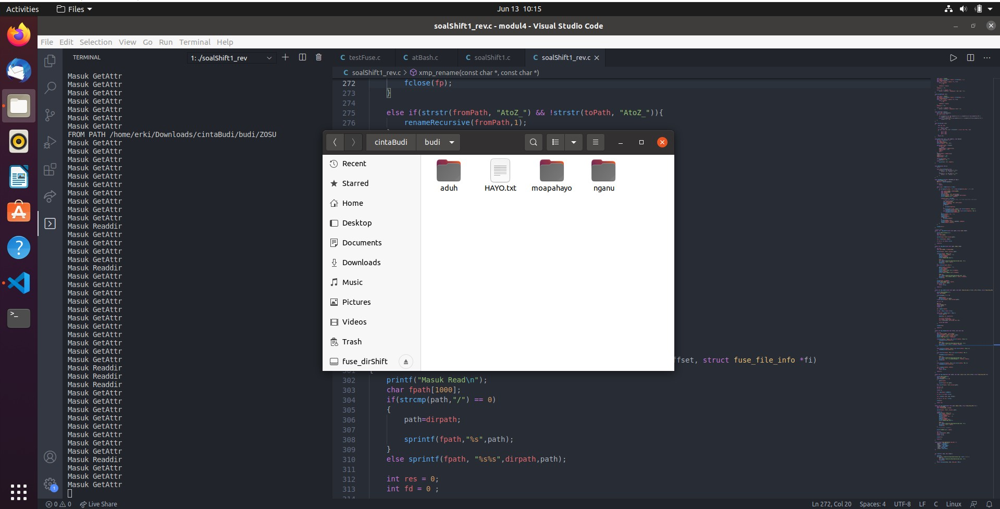
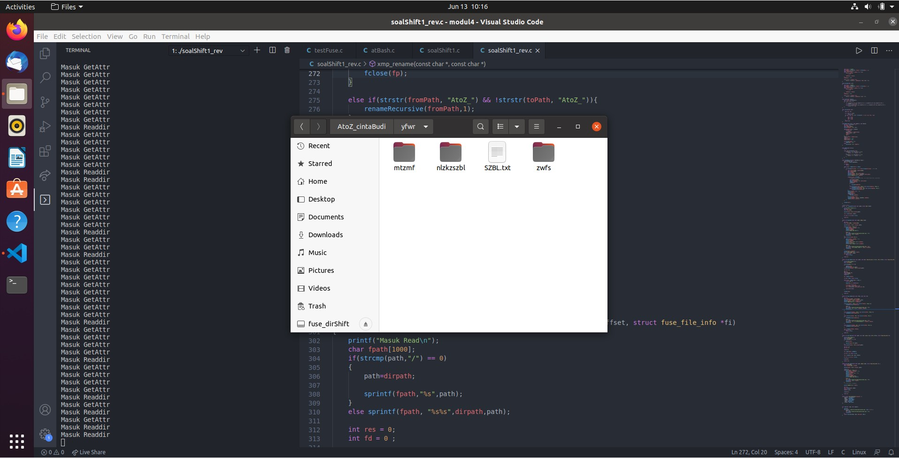

# soal-shift-sisop-modul-4-A01-2021

## Soal Nomor 1

Di suatu jurusan, terdapat admin lab baru yang super duper gabut, ia bernama Sin. Sin baru menjadi admin di lab tersebut selama 1 bulan. Selama sebulan tersebut ia bertemu orang-orang hebat di lab tersebut, salah satunya yaitu Sei. Sei dan Sin akhirnya berteman baik. Karena belakangan ini sedang ramai tentang kasus keamanan data, mereka berniat membuat filesystem dengan metode encode yang mutakhir. Berikut adalah filesystem rancangan Sin dan Sei :

```
Semua file yang berada pada direktori harus ter-encode menggunakan Atbash cipher(mirror).

Misalkan terdapat file bernama kucinglucu123.jpg pada direktori DATA_PENTING

“AtoZ_folder/DATA_PENTING/kucinglucu123.jpg” → “AtoZ_folder/WZGZ_KVMGRMT/pfxrmtofxf123.jpg”

Note : filesystem berfungsi normal layaknya linux pada umumnya, Mount source (root) filesystem adalah directory /home/[USER]/Downloads, dalam penamaan file ‘/’ diabaikan, dan ekstensi tidak perlu di-encode.

Referensi : https://www.dcode.fr/atbash-cipher

```

a. Jika sebuah direktori dibuat dengan awalan “AtoZ_”, maka direktori tersebut akan menjadi direktori ter-encode.

b. Jika sebuah direktori di-rename dengan awalan “AtoZ_”, maka direktori tersebut akan menjadi direktori ter-encode.

c. Apabila direktori yang terenkripsi di-rename menjadi tidak ter-encode, maka isi direktori tersebut akan terdecode.

d. Setiap pembuatan direktori ter-encode (mkdir atau rename) akan tercatat ke sebuah log. Format : **/home/[USER]/Downloads/[Nama Direktori]** → **/home/[USER]/Downloads/AtoZ_[Nama Direktori]**

e. Metode encode pada suatu direktori juga berlaku terhadap direktori yang ada di dalamnya.(rekursif)


## Solusi

### Encryption function

Untuk melakukan encode, diperlukan sebuah fungsi. Pada soal ini, metode encryption yang digunakan adalah atbash cipher(mirror). Untuk implementasinya adalah sebagai berikut.

```c
void atBash(char str[]){
	int i;

	for(i =0;i<strlen(str);i++){
		if(str[i] >= 'A' && str[i] <= 'Z'){
			str[i] = 'Z' - str[i] + 'A';
		}
		if(str[i] >= 'a' && str[i] <= 'z'){
			str[i] = 'z' - str[i] + 'a';
		}
	}
}
```
Pada kepingan kode diatas, fungsi akan melakukan iterasi pada string yang dijadikan parameter. Jika `string[i]` adalah huruf alfabet, maka `string[i]` tersebut akan diubah menjadi mirror dari dirinya sendiri.

### Remove string function

Pada soal ini juga diberikan ketentuan untuk tidak melakukan encryption pada extension sebuah file, untuk melakukan hal ini, digunakan fungsi dibawah ini
```c
.............
char *strrev(char *str)
{
      char *p1, *p2;

      if (! str || ! *str)
            return str;
      for (p1 = str, p2 = str + strlen(str) - 1; p2 > p1; ++p1, --p2)
      {
            *p1 ^= *p2;
            *p2 ^= *p1;
            *p1 ^= *p2;
      }
      return str;
}

void getStr(char str[], char newStr[], char delim){
	int len = strlen(str) - 1;
	int index = 0;
    char tempStr[1024];
    sprintf(tempStr, "%s", str);

	while(tempStr[len] != delim){
        if(len == 0)
            break;
		newStr[index] = tempStr[len];
		tempStr[len] = '\0';
		index++;
		len--;
	}
	newStr[index] = tempStr[len];
	index++;
	newStr[index] = '\0';
	tempStr[len] = '\0';

    if(!strcmp(tempStr, "")) 
        newStr[0] = '\0';
    else
        sprintf(str, "%s", tempStr);
}
.............
```

Pada kepingan kode diatas, fungsi `getStr()` akan memisahkan sebuah pattern string yang diinginkan dan disimpan di dalam parameter `newStr[]` dan masih berbentuk reverse. Untuk melakukan reverse ulang, diperlukan fungsi `strrev`.

### No 1a

Untuk soal ini, jika sebuah directory yang dibuat berawalan "AtoZ_" maka file dalam directory tersebut akan ter-encode. Salah satu cara membuktikan bahwa directory yang baru saja dibuat merupakan directory yang ter-encode adalah dengan membuat file dan directory pada directory yang berawalan "AtoZ_" tersebut.

Jika dipanggil fungsi mkdir atau touch pada directory yang berawalan "AtoZ_", maka file atau folder tersebut akan automatis ter-encode.

**Fungsi mkdir**

```c
static int xmp_mkdir(const char *path, mode_t mode)
{
	int res;
	char fpath[1000], fileName[100];

	sprintf(fpath, "%s%s", dirpath, path);

    if(strstr(fpath, "AtoZ_")){
        getStr(fpath, fileName, '/');
        strrev(fileName);
        atBash(fileName);
        printf("MASUK SINI AJG\n");

        FILE *fp;
        fp = fopen("/home/ahdan/Downloads/encode.log", "a");
        fprintf(fp, "%s\n", fpath);
        fclose(fp);
    }
    else if(strstr(fpath,"RX_"))
    {
        getStr(fpath, fileName, '/');
        strrev(fileName);
        rot13(fileName);
        printf("hasil rot13: %s\n",fileName);
        atBash(fileName);
        printf("hasil atBash: %s\n",fileName);

        FILE *fp;
        fp = fopen("/home/ahdan/Downloads/encode.log", "a");
        fprintf(fp, "%s%s method: mkdir\n", fpath, fileName);
        fclose(fp);
    }

    strcat(fpath, fileName);
	printf("FILE MKDIR %s\n", fpath);
	res = mkdir(fpath, mode);
	if (res == -1)
		return -errno;

	return 0;
}

```

**Fungsi touch**

```c
static int xmp_create(const char* path, mode_t mode, struct fuse_file_info* fi) {
    char fpath[1000];
    char fileName[100], ext[10];

    sprintf(fpath, "%s%s", dirpath, path);
    
    (void) fi;
    if(strstr(fpath, "AtoZ_")){
        getStr(fpath, fileName, '/');
        strrev(fileName);
        getStr(fileName, ext, '.');
        strrev(ext);
        atBash(fileName);
        strcat(fileName, ext);
        printf("MASUK SINI AJG\n");

        FILE *fp;
        fp = fopen("/home/ahdan/Downloads/encode.log", "a");
        fprintf(fp, "%s\n", fpath);
        fclose(fp);
    }
    // strcat(fpath, fileName);

    printf("CREATE %s\n", fpath);
    
    int res;
    res = creat(fpath, mode);
    if(res == -1)
	return -errno;

    close(res);

    return 0;
}

```

Pada kedua kepingan kode diatas, dilakukan pengecekan apakah path yang diberikan mengandung string "AtoZ_"  di awalan filenya. Jika iya, maka path yang ada akan di pisahkan nama file/folder nya. Lalu dilakukan encryption atbash, setelah itu di concantenate kembali ke path yang ada.

### Screenshot pengerjaan no 1A



### No 1b

Untuk soal ini, jika sebuah directory direname dengan awalan "AtoZ_" maka directory tersebut menjadi directory yang terencode. Syarat sebuah directory untuk melakukan encode/decode adalah sebagai berikut.

Jika</br>
1. folder normal menjadi folder dengan awalan "AtoZ_" maka file pada folder tersebut akan terencode
2. folder berawalan "AtoZ_" menjadi folder normal maka filde pada folder tersebut akan terdecode.

Untuk implementasinya dapat dilihat di bawah ini.

**Fungsi rename**

```c
static int xmp_rename(const char *from, const char *to)
{
	int res;
    char fromPath[1000], toPath[1000];
    sprintf(fromPath, "%s%s", dirpath, from);
    sprintf(toPath, "%s%s", dirpath, to);
    printf("FROM PATH %s\n", fromPath);

    if(strstr(toPath, "AtoZ_") && !strstr(fromPath, "AtoZ_")){
        renameRecursive(fromPath,1);
            
        FILE *fp;
        fp = fopen("/home/ahdan/Downloads/encode.log", "a");
        fprintf(fp, "%s -> %s\n", fromPath, toPath);
        fclose(fp);
    }

    .....
    .....
    .....
    .....

    res = rename(fromPath, toPath);
	if (res == -1)
		return -errno;

	return 0;
}
```

Pada kepingan kode di atas, akan dilakukan pengecekan. Jika nama directory pada path yang lama tidak mengandung awalan "AtoZ_" dan pada path yang baru mengandung awalan 'AtoZ_", maka file di dalam directory akan dilakukan encryption.

### Screenshot pengerjaan no 1B



### No 1c

Untuk soal ini, bila sebuah directory yang terencode (mengandung awalan "AtoZ_") direname menjadi folder yang tidak mengandung awalan string tersebut, maka file pada directory tersebut akan terdecode kembali menjadi normal. Untuk implementasinya dapat dilihat di bawah ini.

```c
static int xmp_rename(const char *from, const char *to)
{
	int res;
    char fromPath[1000], toPath[1000];
    sprintf(fromPath, "%s%s", dirpath, from);
    sprintf(toPath, "%s%s", dirpath, to);
    printf("FROM PATH %s\n", fromPath);

    .....
    .....
    .....

    else if(strstr(fromPath, "AtoZ_") && !strstr(toPath, "AtoZ_")){
        renameRecursive(fromPath,1);
    }
    
    .....
    .....
    .....
    

	res = rename(fromPath, toPath);
	if (res == -1)
		return -errno;

	return 0;
}
```
pada kepingan kode diatas, akan dilakukan pengecekan apakah nama directory yang lama mengandung awalan "AtoZ_" dan nama directory yang baru tidak mengandung awalan "AtoZ_". Jika iya, karena metode encryption hanya melakukan mirror dari string yang diberikan, maka decoding dapat dilakukan hanya dengan pemanggilan kembali fungsi `atBash()`.

### Screenshot pengerjaan no 1C



### No 1d

Untuk soal ini, jika program melakukan encoding baik pada saat mkdir ataupun rename, maka akan dicatat di sebuah log dengan format : **/home/[USER]/Downloads/[Nama Direktori]** → **/home/[USER]/Downloads/AtoZ_[Nama Direktori]**. Untuk letak log akan diletakkan di folder downloads dengan nama `encode.log`, implementasinya adalah sebagai berikut


**Fungsi rename**

```c
static int xmp_rename(const char *from, const char *to)
{
	int res;
    char fromPath[1000], toPath[1000];
    sprintf(fromPath, "%s%s", dirpath, from);
    sprintf(toPath, "%s%s", dirpath, to);
    printf("FROM PATH %s\n", fromPath);

    if(strstr(toPath, "AtoZ_") && !strstr(fromPath, "AtoZ_")){
        renameRecursive(fromPath,1);
            
        FILE *fp;
        fp = fopen("/home/ahdan/Downloads/encode.log", "a");
        fprintf(fp, "%s -> %s\n", fromPath, toPath);
        fclose(fp);
    }

   .....
   .....
   .....

	res = rename(fromPath, toPath);
	if (res == -1)
		return -errno;

	return 0;
}

```
**Fungsi mkdir**

```c
static int xmp_mkdir(const char *path, mode_t mode)
{
	int res;
	char fpath[1000], fileName[100];

	sprintf(fpath, "%s%s", dirpath, path);

    if(strstr(fpath, "AtoZ_")){
        getStr(fpath, fileName, '/');
        strrev(fileName);
        atBash(fileName);

        FILE *fp;
        fp = fopen("/home/ahdan/Downloads/encode.log", "a");
        fprintf(fp, "%s\n", fpath);
        fclose(fp);
    }

    .....
    .....
    .....
    .....

    strcat(fpath, fileName);
	printf("FILE MKDIR %s\n", fpath);
	res = mkdir(fpath, mode);
	if (res == -1)
		return -errno;

	return 0;
}

```

Pada kepingan kode diatas, setiap encoding sebuah file/folder akan dicatat di log. Untuk pembuatan log  terdapat di fungsi `main()`.

### Screenshot pengerjaan no 1D




**Fungsi main**

```c
int  main(int  argc, char *argv[])
{
    umask(0);
    if( access( "/home/ahdan/Downloads/encode.log", F_OK ) != 0 ) {
        FILE *fp;
        fp = fopen("/home/ahdan/Downloads/encode.log", "w");
        fclose(fp);
    } 
    return fuse_main(argc, argv, &xmp_oper, NULL);
}
```
Pada fungsi `main()` tersebut, akan dilakukan pengecekan apakah file `encode.log` telah dibuat di folder downloads, bila belum dibuat maka akan dibuat file tersebut.


### No 1e

Untuk soal ini, encoding dan decoding akan berlaku pada sub directory yang terdapat dalam sebuah directory(recursive). Untuk implementasinya dapat dilihat pada code dibawah ini.

**Fungsi main**

```c
void renameRecursive(char *basePath,int tag) {
    struct dirent *dp;
    DIR *dir = opendir(basePath);

    if (!dir)
        return;

    while ((dp = readdir(dir)) != NULL)
    {
        if (strcmp(dp->d_name, ".") != 0 && strcmp(dp->d_name, "..") != 0)
        {
            char newPath[1000], oldPath[1000];
            char newName[256];
            char ext[10];
            sprintf(newName, "%s", dp->d_name);
            sprintf(oldPath, "%s/%s", basePath, dp->d_name);
            printf("NEWPATH %s\n", oldPath);

            if(dp->d_type == DT_DIR){
                //Folder AtoZ_ di dalem AtoZ_. Isi folder dalem AtoZ_ yang dalem 
                // gausah di encrypt
                char tempFold[256];
                sprintf(tempFold, "%s", dp->d_name);
                atBash(tempFold);
                if(tag==2)
                {
                    encryptV(tempFold);
                }
                if(!strstr(dp->d_name, "AtoZ_") && !strstr(tempFold, "AtoZ_"))  
                    renameRecursive(oldPath,1);
                else if(!strstr(dp->d_name, "RX_") && !strstr(tempFold, "RX_"))
                    renameRecursive(oldPath,2);
            }
            getStr(newName, ext, '.');
            strrev(ext);
            atBash(newName);
            if(tag==2){
                encryptV(newName);
            }
            strcat(newName, ext);
            sprintf(newPath, "%s/%s", basePath, newName);
            rename(oldPath, newPath);
        }
    }

    closedir(dir);
}
```

Pada kepingan kode diatas, sebuah path directory awal akan diberikan. Lalu dilakukan iterasi pada isi dalam file tersebut. Jika terdapat sebuah folder yang tidak mengandung awalan "AtoZ_", maka akan dilakukan pemanggilan fungsi `renameRecursive()` dengan parameter path dari file dari directory tersebut (recurrence). 

Pada implementasi diatas, jika terdapat sebuah folder yang telah terencrypt di dalam sebuah folder yang telah terencrypt, maka tidak dilakukan encryption kembali karena namaa file pada sub-directory tersebut akan menjadi normal.

### Screenshot pengerjaan no 1E



## Soal Nomor 2
Selain itu Sei mengusulkan untuk membuat metode enkripsi tambahan agar data pada komputer mereka semakin aman. Berikut rancangan metode enkripsi tambahan yang dirancang oleh Sei:

a. Jika sebuah direktori dibuat dengan awalan “RX_[Nama]”, maka direktori tersebut akan menjadi direktori terencode beserta isinya dengan perubahan nama isi sesuai kasus nomor 1 dengan algoritma tambahan ROT13 (Atbash + ROT13).

b. Jika sebuah direktori di-rename dengan awalan “RX_[Nama]”, maka direktori tersebut akan menjadi direktori terencode beserta isinya dengan perubahan nama isi sesuai dengan kasus nomor 1 dengan algoritma tambahan Vigenere Cipher dengan key “SISOP” (Case-sensitive, Atbash + Vigenere).

c. Apabila direktori yang terencode di-rename (Dihilangkan “RX_” nya), maka folder menjadi tidak terencode dan isi direktori tersebut akan terdecode berdasar nama aslinya.

 
d. Setiap pembuatan direktori terencode (mkdir atau rename) akan tercatat ke sebuah log file beserta methodnya (apakah itu mkdir atau rename).

e. Pada metode enkripsi ini, file-file pada direktori asli akan menjadi terpecah menjadi file-file kecil sebesar 1024 bytes, sementara jika diakses melalui filesystem rancangan Sin dan Sei akan menjadi normal. Sebagai contoh, Suatu_File.txt berukuran 3 kiloBytes pada directory asli akan menjadi 3 file kecil yakni:

Suatu_File.txt.0000
Suatu_File.txt.0001
Suatu_File.txt.0002

Ketika diakses melalui filesystem hanya akan muncul Suatu_File.txt

### Jawaban No 2a
Basic nya sama seperti no 1 hanya saja berbeda di cara enkripsi nya. Enkripsi di no 2 menggunakan enkripsi Atbash+ROT13 berikut fungsi ROT13 nya:
```c
void rot13(char *start){
    int i, len = strlen(start);
    for (i=0; i<len; i++)
    {
        if( (*(start+i)>='a' && *(start+i)<'n') || (*(start+i)>='A' && *(start+i)<'N') )
            *(start + i) += 13;
        else if ( (*(start+i)>'m' && *(start+i)<'z') || (*(start+i)>'M' && *(start+i)<'Z') )
            *(start +i) -= 13;
    }
}
```
Berikut saat fungsi saat program akan dijalankan dan proses enkripsi saat di makedir:
```c
else if(strstr(fpath,"RX_"))
    {
        getStr(fpath, fileName, '/');
        strrev(fileName);
        rot13(fileName);
        printf("hasil rot13: %s\n",fileName);
        atBash(fileName);
        printf("hasil atBash: %s\n",fileName);

        FILE *fp;
        fp = fopen("/home/ahdan/Downloads/encode.log", "a");
        fprintf(fp, "%s%s method: mkdir\n", fpath, fileName);
        fclose(fp);
    }
```

### Jawaban No 2b
Di sini berbeda metode pengenkripsiannya dengan 2a karena disini enkripsi nya adalah Atbash + vigenere oleh karena itu ddiberi fungsi tambahan untuk encrypt dan decrypt. Berikut adalah fungsinya:
```c
void decryptV(char *str)
{
    char key[] = "SISOP";
    int msgLen = strlen(str), keyLen = strlen(key), i ,j;
    char newKey[msgLen];
    for(i = 0, j = 0; i < msgLen; ++i, ++j){
        if(j == keyLen)
            j = 0;
 
        newKey[i] = key[j];
    }
    newKey[i] = '\0';

    for(i = 0; i < msgLen; ++i)
        str[i] = (((str[i] - newKey[i]) + 26) % 26) + 'A';
}

void encryptV(char *str)
{
    char key[] = "SISOP";
    int msgLen = strlen(str), keyLen = strlen(key), i ,j;
    char newKey[msgLen];
    for(i = 0, j = 0; i < msgLen; ++i, ++j){
        if(j == keyLen)
            j = 0;
 
        newKey[i] = key[j];
    }
    newKey[i] = '\0';

    for(i = 0; i < msgLen; ++i)
        str[i] = ((str[i] + newKey[i]) % 26) + 'A';
}
```
Algoritma vigenere diatas menggunakan key "SISOP" untuk encrypt dan decrypt string yang akan diencode/decode. Diberi tambahan di fungsi rename dan  renameRecursively.:
```c
void renameRecursive(char *basePath,int tag) {
    struct dirent *dp;
    DIR *dir = opendir(basePath);

    if (!dir)
        return;

    while ((dp = readdir(dir)) != NULL)
    {
        if (strcmp(dp->d_name, ".") != 0 && strcmp(dp->d_name, "..") != 0)
        {
            char newPath[1000], oldPath[1000];
            char newName[256];
            char ext[10];
            sprintf(newName, "%s", dp->d_name);
            sprintf(oldPath, "%s/%s", basePath, dp->d_name);
            printf("NEWPATH %s\n", oldPath);

            if(dp->d_type == DT_DIR){
                //Folder AtoZ_ di dalem AtoZ_. Isi folder dalem AtoZ_ yang dalem 
                // gausah di encrypt
                char tempFold[256];
                sprintf(tempFold, "%s", dp->d_name);
                atBash(tempFold);
                if(tag==2)
                {
                    encryptV(tempFold);
                }
                if(!strstr(dp->d_name, "AtoZ_") && !strstr(tempFold, "AtoZ_"))  
                    renameRecursive(oldPath,1);
                else if(!strstr(dp->d_name, "RX_") && !strstr(tempFold, "RX_"))
                    renameRecursive(oldPath,2);
            }
            getStr(newName, ext, '.');
            strrev(ext);
            atBash(newName);
            if(tag==2){
                encryptV(newName);
            }
            strcat(newName, ext);
            sprintf(newPath, "%s/%s", basePath, newName);
            rename(oldPath, newPath);
        }
    }

    closedir(dir);
}
```

```c
static int xmp_rename(const char *from, const char *to)
{
	int res;
    char fromPath[1000], toPath[1000];
    sprintf(fromPath, "%s%s", dirpath, from);
    sprintf(toPath, "%s%s", dirpath, to);
    printf("FROM PATH %s\n", fromPath);

    if(strstr(toPath, "AtoZ_") && !strstr(fromPath, "AtoZ_")){
        renameRecursive(fromPath,1);
            
        FILE *fp;
        fp = fopen("/home/ahdan/Downloads/encode.log", "a");
        fprintf(fp, "%s -> %s\n", fromPath, toPath);
        fclose(fp);
    }

    else if(strstr(fromPath, "AtoZ_") && !strstr(toPath, "AtoZ_")){
        renameRecursive(fromPath,1);
    }
    
    else if(strstr(toPath, "RX_") && !strstr(fromPath, "RX_"))
    {
        renameRecursive(fromPath,2);
            
        FILE *fp;
        fp = fopen("/home/ahdan/Downloads/encode.log", "a");
        fprintf(fp, "%s -> %s method:Rename\n", fromPath, toPath);
        fclose(fp);
    }

    else if(strstr(fromPath, "RX_") && !strstr(toPath, "RX_")){
        renameRecursive(fromPath,2);
    }

	res = rename(fromPath, toPath);
	if (res == -1)
		return -errno;

    const char *desc[] = {from,to};
    fsLog("INFO","RENAME",2, desc);
	return 0;
}
```

### Jawaban No 2d
Sama seperti no1 sebelumnya

Kendala: tidak bisa decode dengan dua metode enkripsi yg berbeda dan bingung di soal 2e

### ScreenShot No 2
no2a.

.png)
.png)
.png)

no2b.

.png)
.png)
.png)

no2d.

.png)

## Soal Nomor 3
Karena Sin masih super duper gabut akhirnya dia menambahkan sebuah fitur lagi pada filesystem mereka. 
a. Jika sebuah direktori dibuat dengan awalan “A_is_a_”, maka direktori tersebut akan menjadi sebuah direktori spesial.

b. Jika sebuah direktori di-rename dengan memberi awalan “A_is_a_”, maka direktori tersebut akan menjadi sebuah direktori spesial.

c. Apabila direktori yang terenkripsi di-rename dengan menghapus “A_is_a_” pada bagian awal nama folder maka direktori tersebut menjadi direktori normal.

d. Direktori spesial adalah direktori yang mengembalikan enkripsi/encoding pada direktori “AtoZ_” maupun “RX_” namun masing-masing aturan mereka tetap berjalan pada direktori di dalamnya (sifat recursive  “AtoZ_” dan “RX_” tetap berjalan pada subdirektori).

e. Pada direktori spesial semua nama file (tidak termasuk ekstensi) pada fuse akan berubah menjadi lowercase insensitive dan diberi ekstensi baru berupa nilai desimal dari binner perbedaan namanya.


Contohnya jika pada direktori asli nama filenya adalah “FiLe_CoNtoH.txt” maka pada fuse akan menjadi “file_contoh.txt.1321”. 1321 berasal dari biner 10100101001.

### Jawaban No3
Maaf masih bingung dengan maksud soal (direktori spesial) tidak sempat mengerjakan.

## Soal Nomor 4
Untuk memudahkan dalam memonitor kegiatan pada filesystem mereka Sin dan Sei membuat sebuah log system dengan spesifikasi sebagai berikut.

a. Log system yang akan terbentuk bernama “SinSeiFS.log” pada direktori home pengguna (/home/[user]/SinSeiFS.log). Log system ini akan menyimpan daftar perintah system call yang telah dijalankan pada filesystem.

b. Karena Sin dan Sei suka kerapian maka log yang dibuat akan dibagi menjadi dua level, yaitu INFO dan WARNING.

c. Untuk log level WARNING, digunakan untuk mencatat syscall rmdir dan unlink.

d. Sisanya, akan dicatat pada level INFO.

e. Format untuk logging yaitu:
```
[Level]::[dd][mm][yyyy]-[HH]:[MM]:[SS]:[CMD]::[DESC :: DESC]

Level : Level logging, dd : 2 digit tanggal, mm : 2 digit bulan, yyyy : 4 digit tahun, HH : 2 digit jam (format 24 Jam),MM : 2 digit menit, SS : 2 digit detik, CMD : System Call yang terpanggil, DESC : informasi dan parameter tambahan

INFO::28052021-10:00:00:CREATE::/test.txt
INFO::28052021-10:01:00:RENAME::/test.txt::/rename.txt
```
### Jawaban No 4
Untuk membuat system log dibutuhkan fungsi yang akan mencatat di log dengan path yang dituju:
```c
void fsLog(char *level, char *cmd,int descLen, const char *desc[])
{
    FILE *f = fopen("/home/ahdan/SinSeiFS.log", "a");
    time_t now;
	time ( &now );
	struct tm * times = localtime (&now);
	fprintf(f, "%s::%s::%02d%02d%04d-%02d:%02d:%02d",level,cmd,times->tm_mday,times->tm_mon+1,times->tm_year+1900,times->tm_hour, times->tm_min, times->tm_sec);
    for(int i = 0; i<descLen; i++)
    {
        fprintf(f,"::%s",desc[i]);
    }
    fprintf(f,"\n");
    fclose(f);
}
```

Bagian `fprintf(f, "%s::%s::%02d%02d%04d-%02d:%02d:%02d",level,cmd,times->tm_mday,times->tm_mon+1,times->tm_year+1900,times->tm_hour, times->tm_min, times->tm_sec);` akan menaruh data dari akses fungsi ke log file dengan time now. Parameter akan menyesuaikan dengan fungsi yang memanggil fungsi log contoh: `fsLog("INFO","GETATTR",1, desc);` call fuction tsb akan ditaurh di fungsi `xmp_getattr`.

Kendala : Tidak Ada
### Screenshot No.4
.png)
